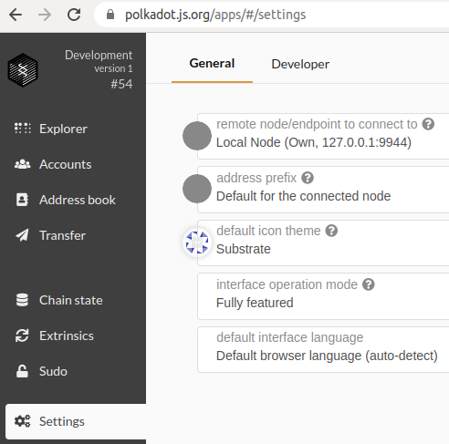
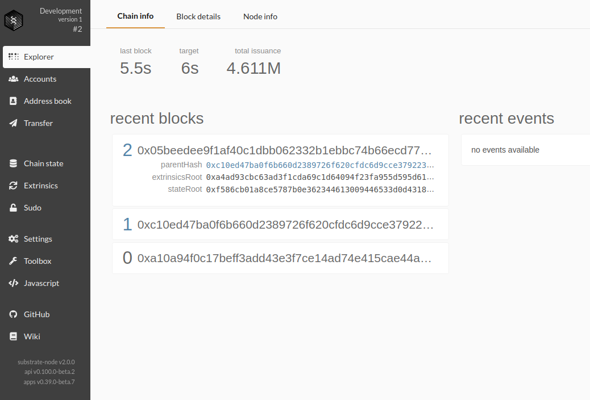
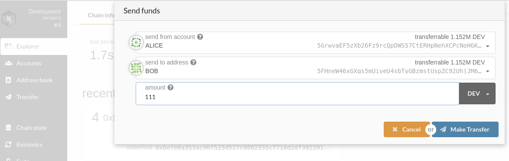
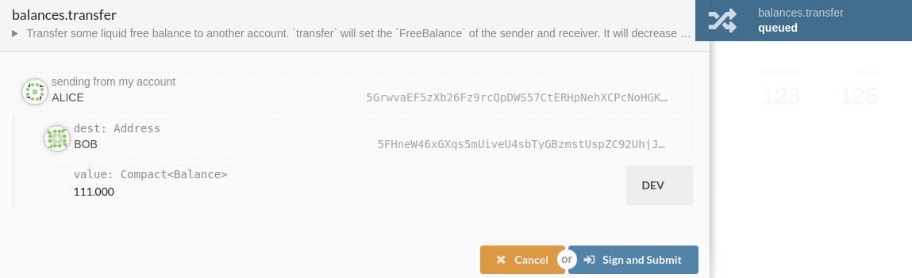
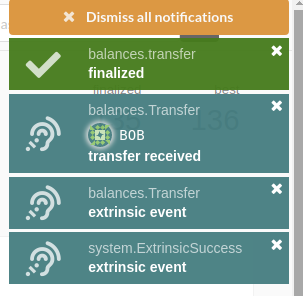
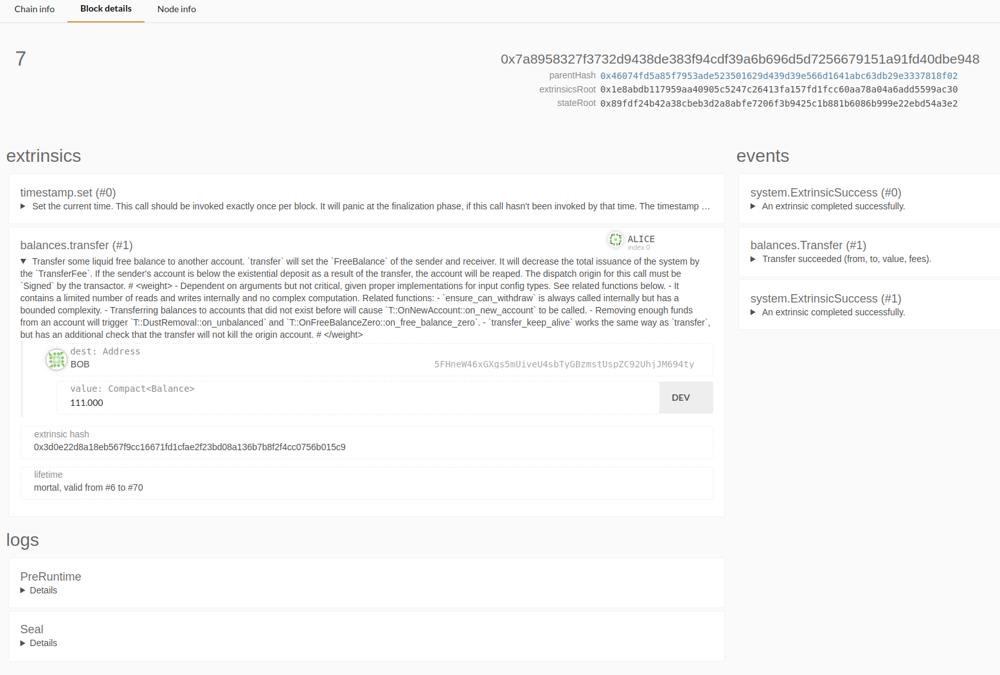

# 创建节点
* curl https://raw.githubusercontent.com/paritytech/substrate-up/9c966504b4a60c2e6b9187b118926a12d2da9448/substrate-node-new -sSf|bash -s substrate-kitties Ratentlan

# 启动节点
* WASM_BUILD_TYPE=release cargo run -- --dev -d target/substrate --execution=NativeElseWasm

# 配置 explorer
* https://polkadot.js.org/apps/#/settings
* 

# chain info

# 转帐

