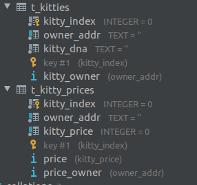

# 第六课
    1. 使用 pallet-balances 模块
    2. Dependency Injection 依赖注入
    3. Events 事件
    4. ORML 介绍
    5. 如何集成 orml-auction

# 第六课作业
## 1. 添加 `Ask` 和 `Sold` event
runtime/src/kitties.rs:113
runtime/src/kitties.rs:136

## 2. 使用 `LinkedList` 重构 OwnedKitties 和 KittyLinkedItem 
runtime/src/kitties.rs:24

### 测试可以通过
runtime/src/kitties.rs:295


# 额外作业

## 1. 利用 polkadot.js 开发一个node.js服务器

### 监听并存储所有 kitties 事件到数据库
* 
* 这里使用了Sqlite3数据库.

#### 启动服务器&测试
* s/build.sh # 启动区块链
* cd cmdapp
* make # 启动中心化服务器, 处理事件
* make create # Alice创建猫
* make create # Alice创建猫
* make query # 对比当前DB和链上数据
* node src/alice_ask_kitty.js 0 100 # Alice卖第0只猫, 100钱.
* make query # 对比当前DB和链上数据
* node src/bob_buy_kitty.js 0 100 # Bob买猫
* make query # 对比当前DB和链上数据

### 设计并讨论如何使用事件和链下数据库来简化链上存储
```text
下面提出个需求, 要遍历所有在出售的猫. 
我们可以在维护一个数组保存于链上代表在出售的猫. 但是这样每次有买卖
的时候, 对链的操作会稍微多一下, 并且对链空间的需求会大一些. 

不带入更多链操作和消耗更多链空间的前提下, 实现这个需求
我们可以监听链上每个块中的事件:
Ask(AccountId, KittyIndex, Option<Balance>),
Sold(AccountId, AccountId, KittyIndex, Balance),
根据监听的事件来维护中心化数据库. 

举个例子: 
在Mysql中建立表 t_kitty_price { kitty_id, price, owner }

收到Ask事件, 我们可以 insert 到 t_kitty_price. 
收到Sold事件, 我们可以从 t_kitty_price 中删除. 
展示出售的猫的时候, 可以遍历 t_kitty_price 表.
```


